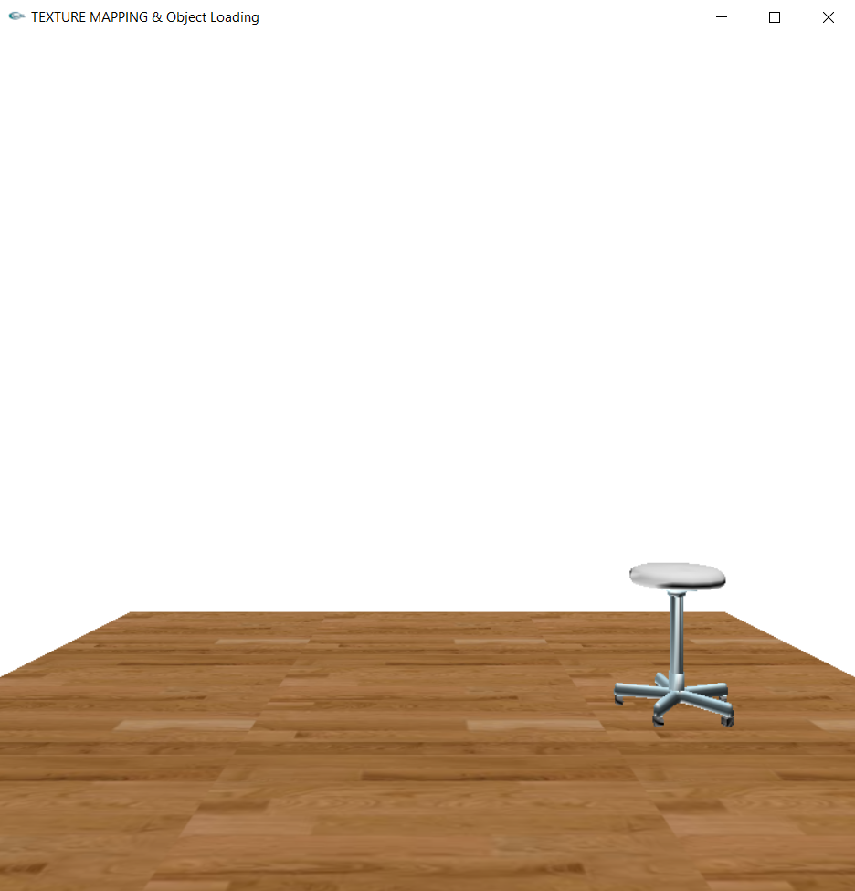
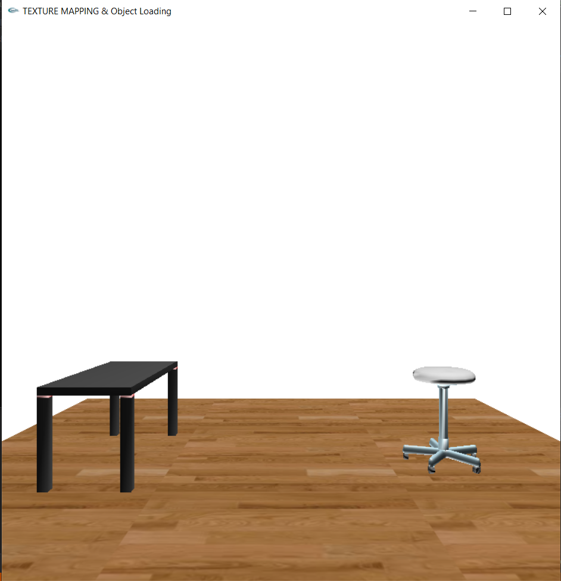
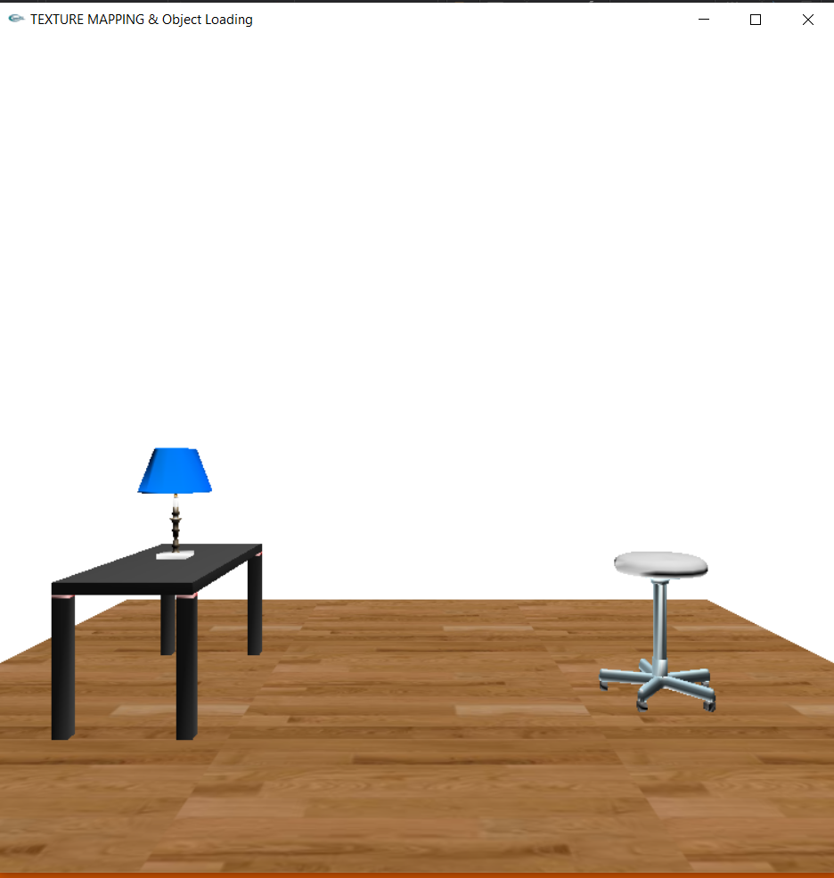

# Task 3 Texture Mapping & Object Loading:

# Task Requirment:

It was required to design a 3d sence containing a floor and some objects. <br>

> First, We started by adding the floor to our scene and suit its size to fit the camera location. <br>

```
glPushMatrix();
	glEnable(GL_TEXTURE_2D);
	glBindTexture(GL_TEXTURE_2D, _textureId);
	glTexParameteri(GL_TEXTURE_2D, GL_TEXTURE_MIN_FILTER, GL_LINEAR);
	glTexParameteri(GL_TEXTURE_2D, GL_TEXTURE_MAG_FILTER, GL_LINEAR);
	glBegin(GL_QUADS);
	glNormal3f(0.0, 1.0, 0.0);
	glTexCoord2f(0.0f, 0.0f); glVertex3f(-2, -1,  2);
	glTexCoord2f(3.0f, 0.0f); glVertex3f( 2, -1,  2);
	glTexCoord2f(3.0f, 3.0f); glVertex3f( 2, -1, -2);
	glTexCoord2f(0.0f, 3.0f); glVertex3f(-2, -1, -2);
	glEnd();
	glDisable(GL_TEXTURE_2D);
glPopMatrix();
```


> Then, we started placing objects in our scene. <br>

Using the Function Draw_Model():

```
// Draw Model Function:
void drawmodel(char* filename)
{
	GLMmodel* model = glmReadOBJ(filename);
	glmUnitize(model);
	glmFacetNormals(model);
	glmVertexNormals(model, 90.0);
	glmScale(model, .15);
	glmDraw(model, GLM_SMOOTH | GLM_MATERIAL);
}
```

__1. Placing The Stool.__<br>

```
glPushMatrix();
	glTranslatef(1, -0.7, 0.0);
	glScalef(20, 20, 20);
	drawmodel((char*)stool);
glPopMatrix();
```


__2. Placing The Table.__<br>


```
glPushMatrix();
	glTranslatef(-1.0, -0.7, 0.0);
	glRotatef(90, 0, 1.0, 0);
	glScalef(25, 25, 25);
	drawmodel((char*)table);
glPopMatrix();
```



__3. Placing The Desk Lamp on the Table.__ <br>


```
glPushMatrix();
	glTranslatef(-1.0, -0.2, 0.0);
	glScalef(1.5, 1.5, 1.5);
	drawmodel((char*)lamp);
glPopMatrix();
```



__4. Placing The Full Robot Body.__ <br>

```
    // Here the code made in previous task (Full Robot body) is added
```
 <br> <br>

> ### After that we started to animate our Robot in the scene.

> ### We made three different animations: 
<br>

> First We got the poses of each animation and save it in a 2D Vector.

```
typedef std::vector<std::vector<int>> matrix;

matrix animation_1 = {
    {0, 0, 0, 0, 0, 0, 0, 0, 0, 0, 0, 0, 0, 0, 0, 0, 0, 0, 0},
    {45, 0, 0, 0, 0, 0, 0, 0, 0, -45, 0, 0, -45, 0, 45, 0, 0, 0, 0},
    {90, 0, 0, 0, 0, 0, 0, 0, 0, -90, 0, 0, -90, 0, 90, 0 ,0, 0, 0},
    {45, 0, 0, 0, 0, 0, 0, 0, 0, -45, 0, 0, -45, 0, 45, 0, 0, 0, 0},
    {0, 0, 0, 0, 0, 0, 0, 0, 0, 0, 0, 0, 0, 0, 0, 0, 0, 0, 0},
    {45, 0, 0, 0, -45, 0, 45, 0, 0, -45, 0, 0, 0, 0, 0, 0, 0, 0, 0},
    {90, 0, 0, 0, -90, 0, 90, 0, 0, -90, 0, 0, 0, 0, 0, 0 ,0, 0, 0},
    {45, 0, 0, 0, -45, 0, 45, 0, 0, -45, 0, 0, 0, 0, 0, 0, 0, 0, 0},
    {0, 0, 0, 0, 0, 0, 0, 0, 0, 0, 0, 0, 0, 0, 0, 0, 0, 0, 0}
};

matrix animation_2 = {
    {0, 0, 0, 0, 0, 0, 0, 0, 0, 0, 0, 0, 0, 0, 0, 0, 0 , 0, 0},
    {47, 0, 33, 0, 0, 8, 0, 0, 0, -47, 0, -33, 0, -8, 0, 0, 0, 1, 0},
    {94, 0, 66, 0, 0, 17, 0, 0, 0, -94, 0, -66, 0, -17, 0, 0, 0, 2, 0},
    {140, 0, 100, 0, 0, 25, 0, 0, 0, -140, 0, -100, 0, -25, 0, 0, 0, 3, 0},
    {94, 0, 66, 0, 0, 17, 0, 0, 0, -94, 0, -66, 0, -17, 0, 0, 0, 2, 0},
    {47, 0, 33, 0, 0, 8, 0, 0, 0, -47, 0, -33, 0, -8, 0, 0, 0, 1, 0},
    {0, 0, 0, 0, 0, 0, 0, 0, 0, 0, 0, 0, 0, 0, 0, 0, 0 , 0, 0}
};

matrix animation_3 = {
    {0, 0, 0, 0, 0, 0, 0, 0, 0, 0, 0, 0, 0, 0, 0, 0, 0, 0, -90},
    {0, -55, -15, 0, 0, 0, 0, 0, 0, 0, -55, 15, 0, 0, 0, 0, 0, 1, -90},
    {0, -85, -15, 0, 0, 0, 0, 0, 0, 0, -85, 15, 0, 0, 0, 0 ,0, 2, -90},
    {0, -55, -15, 0, 0, 0, 0, 0, 0, 0, -55, 15, 0, 0, 0, 0, 0 ,1, -90},
    {0, 0, 0, 0, 0, 0, 0, 0, 0, 0, 0, 0, 0, 0, 0, 0, 0, 0, -90}
};
```

> Then applying these 2D vectors to a 3D vector to choose different poses.

```
typedef std::vector<std::vector<std::vector<int>>> vec3D;

vec3D animation = {
    animation_1,
    animation_2,
    animation_3
};
```

> Then making each pose as a frame.

```
void setAngles(int frameIndex) {
    shoulder = animation[animationSelector][frameIndex][0];
    shoulder_x = animation[animationSelector][frameIndex][1];
    elbow = animation[animationSelector][frameIndex][2];
    body = animation[animationSelector][frameIndex][3];
    leftLegX = animation[animationSelector][frameIndex][4];
    leftLegZ = animation[animationSelector][frameIndex][5];
    leftKneeX = animation[animationSelector][frameIndex][6];
    leftKneeZ = animation[animationSelector][frameIndex][7];
    LeftFoot = animation[animationSelector][frameIndex][8];
    shoulder_2 = animation[animationSelector][frameIndex][9];
    shoulder_x2 = animation[animationSelector][frameIndex][10];
    elbow_2 = animation[animationSelector][frameIndex][11];
    rightLegX = animation[animationSelector][frameIndex][12];
    rightLegZ = animation[animationSelector][frameIndex][13];
    rightKneeX = animation[animationSelector][frameIndex][14];
    rightKneeZ = animation[animationSelector][frameIndex][15];
    RightFoot = animation[animationSelector][frameIndex][16];
    jump = animation[animationSelector][frameIndex][17];
    rotationAngel = animation[animationSelector][frameIndex][18];
}

static int frame = 0;

void timer(int value) {
    frame = frame % animation[animationSelector].size();
    setAngles(frame);
    frame++;
    glutPostRedisplay();
    glutTimerFunc(150, timer, 0);
}
```

> The last two arguments in setAngles Function:
1. Jump for jumping animation.
2. rotationAngle for turning left and holding the lamp.


> Then Menu to choose Between Animations:

```
void screen_menu(int value)
{
    switch (value) {
        case 0:
        case 1:
        case 2:
            animationSelector = value;
            break;
        case 3:
            path = "images/test.bmp";
            initRendering();
            break;
        case 4:
            path = "images/test1.bmp";
            initRendering();
            break;
        default:
            break;
    }
    frame = 0;
    reset();
    glutPostRedisplay();
}
```

__1. First Animation (Doing Excercise)__ <br>


__2. Second Animation (Jumping)__ <br>

```
// Some code added before drawing the body for jump ratio
if (animationSelector == 1)
        glTranslatef(0.0, Y_ELEVEATION_RATIO * jump, 0.0);
```


__3. Third Animation (Holding Desklamp and lifting it up)__ <br>

> This is the animation of robot interacting with the loaded objects

```
// Some code added before drawing the body for jump ratio
	if (animationSelector == 1)
        glTranslatef(0.0, Y_ELEVEATION_RATIO * jump, 0.0);
    else if (animationSelector == 2)
        glTranslatef(-2, 0.0, 0.0);
	glRotatef((GLfloat)rotationAngel, 0, 1.0, 0);
```
 <br>

__### The last thing to do is loading different textures to the floor__

__1. First Texture (Natural Wallpaper)__<br>

 

__2. Second Texture (Kung Fu Panda)__<br>

 

> All these options are added to a menu binned with the right button of the mouse.

 

## Issues Faced:

At the begining we got confused about how to merge everything together. Then started doing it by steps as mentioned above. <br>
Then, we faced issue about sizes of objects and solved it using glScale() function.<br>
The confusing part was the interacting with the objects loaded and managed to solve this by adding two variables to the poses vector one for the jumpimg ratio and the second one was for the rotation angle. <br>
